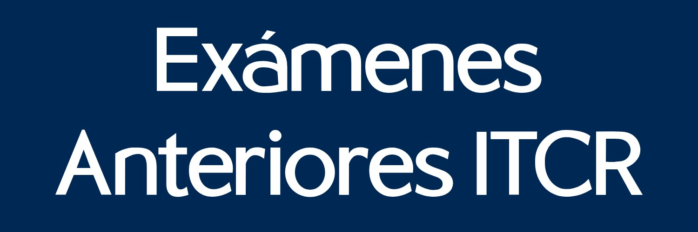

> **Advertencia**  
> La intención es recopilar y distribuir exámenes de cátedra, manteniendo la discreción debido a que ciertos profesores prefieren que no se difunda su material.

Repositorio público para compartir exámenes anteriores en PDF.

El sitio se actualiza automáticamente según los archivos agregados.
Para contribuir, solo necesita agregar PDFs con el formato correcto.

## Fuente de Archivos

- Los PDFs y metadatos ahora se mantienen en: https://github.com/rgdan/examenes-anteriores-itcr-archivos
- Este repositorio genera y publica el sitio consumiendo esos archivos durante GitHub Actions.
- Para agregar o corregir exámenes, realice los cambios en el repositorio de archivos.

## Examenes buscados

Para obtener una buena selección de exámenes en el repositorio, se buscan los siguientes documentos según la tabla.

| Símbolo | Significado |
| :--- | :--- |
| ✔️| Ya se tiene el repositorio |
| ❌ | Todavía no se tiene en el repositorio |
| ⬜ | No se puede obtener o no existe |

<table>
  <tr>
    <th colspan="4"></th>
    <th>MG</th><th>MD</th><th>ED</th><th>CS</th><th>CAL</th><th>CDI</th><th>PB</th><th>ES</th>
  </tr>
  <tr>
    <td rowspan="16"><b>2025</b></td>
    <td rowspan="8"><b>IS</b></td>
    <td rowspan="2"><b>P1</b></td>
    <td>Enunciado</td>
    <td>❌</td><td>❌</td><td>❌</td><td>✔️</td><td>❌</td><td>❌</td><td>❌</td><td>❌</td>
  </tr>
  <tr>
    <td>Solucionario</td>
    <td>❌</td><td>❌</td><td>❌</td><td>❌</td><td>❌</td><td>❌</td><td>❌</td><td>❌</td>
  </tr>
  <tr>
    <td rowspan="2"><b>P2</b></td>
    <td>Enunciado</td>
    <td>❌</td><td>❌</td><td>❌</td><td>✔️</td><td>❌</td><td>❌</td><td>❌</td><td>❌</td>
  </tr>
  <tr>
    <td>Solucionario</td>
    <td>✔️</td><td>❌</td><td>❌</td><td>❌</td><td>✔️</td><td>❌</td><td>❌</td><td>❌</td>
  </tr>
  <tr>
    <td rowspan="2"><b>P3</b></td>
    <td>Enunciado</td>
    <td>❌</td><td>❌</td><td>❌</td><td>❌</td><td>❌</td><td>❌</td><td>❌</td><td>⬜</td>
  </tr>
  <tr>
    <td>Solucionario</td>
    <td>✔️</td><td>❌</td><td>❌</td><td>❌</td><td>✔️</td><td>❌</td><td>❌</td><td>⬜</td>
  </tr>
  <tr>
    <td rowspan="2"><b>RP</b></td>
    <td>Enunciado</td>
    <td>❌</td><td>❌</td><td>❌</td><td>❌</td><td>❌</td><td>❌</td><td>❌</td><td>❌</td>
  </tr>
  <tr>
    <td>Solucionario</td>
    <td>❌</td><td>❌</td><td>❌</td><td>❌</td><td>❌</td><td>❌</td><td>❌</td><td>❌</td>
  </tr>
  <tr>
    <td rowspan="8"><b>IIS</b></td>
    <td rowspan="2"><b>P1</b></td>
    <td>Enunciado</td>
    <td>❌</td><td>❌</td><td>❌</td><td>❌</td><td>❌</td><td>❌</td><td>❌</td><td>❌</td>
  </tr>
  <tr>
    <td>Solucionario</td>
    <td>❌</td><td>❌</td><td>❌</td><td>❌</td><td>❌</td><td>❌</td><td>❌</td><td>❌</td>
  </tr>
  <tr>
    <td rowspan="2"><b>P2</b></td>
    <td>Enunciado</td>
    <td>❌</td><td>❌</td><td>❌</td><td>❌</td><td>❌</td><td>❌</td><td>❌</td><td>❌</td>
  </tr>
  <tr>
    <td>Solucionario</td>
    <td>❌</td><td>❌</td><td>❌</td><td>❌</td><td>❌</td><td>❌</td><td>❌</td><td>❌</td>
  </tr>
  <tr>
    <td rowspan="2"><b>P3</b></td>
    <td>Enunciado</td>
    <td>❌</td><td>❌</td><td>❌</td><td>❌</td><td>❌</td><td>❌</td><td>❌</td><td>⬜</td>
  </tr>
  <tr>
    <td>Solucionario</td>
    <td>❌</td><td>❌</td><td>❌</td><td>❌</td><td>❌</td><td>❌</td><td>❌</td><td>⬜</td>
  </tr>
  <tr>
    <td rowspan="2"><b>RP</b></td>
    <td>Enunciado</td>
    <td>❌</td><td>❌</td><td>❌</td><td>❌</td><td>❌</td><td>❌</td><td>❌</td><td>❌</td>
  </tr>
  <tr>
    <td>Solucionario</td>
    <td>❌</td><td>❌</td><td>❌</td><td>❌</td><td>❌</td><td>❌</td><td>❌</td><td>❌</td>
  </tr>
  <tr>
    <td rowspan="8"><b>2026</b></td>
    <td rowspan="8"><b>IS</b></td>
    <td rowspan="2"><b>P1</b></td>
    <td>Enunciado</td>
    <td>❌</td><td>❌</td><td>❌</td><td>❌</td><td>❌</td><td>❌</td><td>❌</td><td>❌</td>
  </tr>
  <tr>
    <td>Solucionario</td>
    <td>❌</td><td>❌</td><td>❌</td><td>❌</td><td>❌</td><td>❌</td><td>❌</td><td>❌</td>
  </tr>
  <tr>
    <td rowspan="2"><b>P2</b></td>
    <td>Enunciado</td>
    <td>❌</td><td>❌</td><td>❌</td><td>❌</td><td>❌</td><td>❌</td><td>❌</td><td>❌</td>
  </tr>
  <tr>
    <td>Solucionario</td>
    <td>❌</td><td>❌</td><td>❌</td><td>❌</td><td>❌</td><td>❌</td><td>❌</td><td>❌</td>
  </tr>
  <tr>
    <td rowspan="2"><b>P3</b></td>
    <td>Enunciado</td>
    <td>⬜</td><td>⬜</td><td>⬜</td><td>⬜</td><td>⬜</td><td>⬜</td><td>⬜</td><td>⬜</td>
  </tr>
  <tr>
    <td>Solucionario</td>
    <td>⬜</td><td>⬜</td><td>⬜</td><td>⬜</td><td>⬜</td><td>⬜</td><td>⬜</td><td>⬜</td>
  </tr>
  <tr>
    <td rowspan="2"><b>RP</b></td>
    <td>Enunciado</td>
    <td>⬜</td><td>⬜</td><td>⬜</td><td>⬜</td><td>⬜</td><td>⬜</td><td>⬜</td><td>⬜</td>
  </tr>
  <tr>
    <td>Solucionario</td>
    <td>⬜</td><td>⬜</td><td>⬜</td><td>⬜</td><td>⬜</td><td>⬜</td><td>⬜</td><td>⬜</td>
  </tr>
</table>

## Documentación Técnica

- Nomenclatura de carpetas, PDFs y metadatos: [docs/NOMENCLATURE.md](docs/NOMENCLATURE.md)
- Documentación de desarrollo: [docs/DEVELOPMENT.md](docs/DEVELOPMENT.md)
