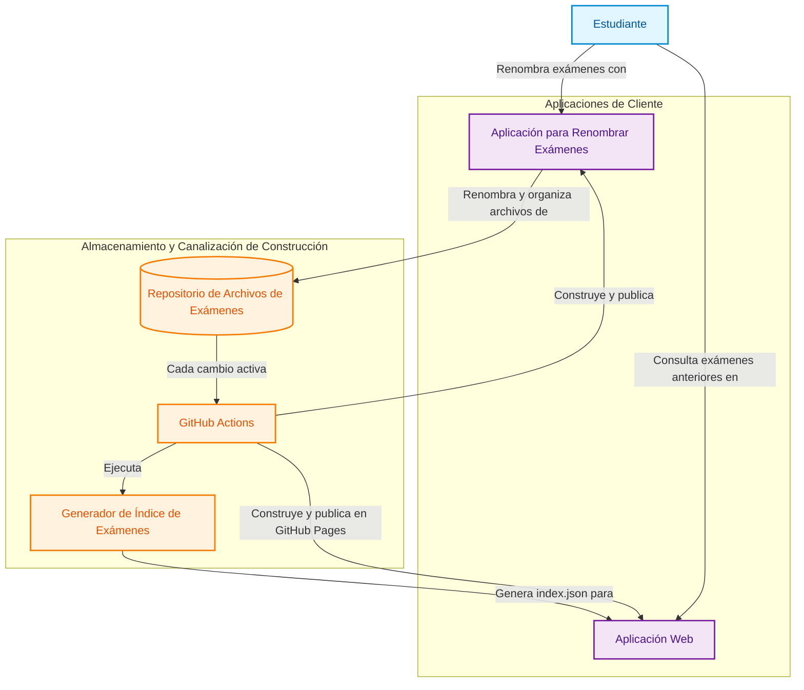

Repositorio público para acceder y navegar exámenes anteriores en PDF. La página web estática se genera a partir de los archivos y metadatos alojados en el repositorio de archivos separado.

---

## Documentación y Contribuciones

Para saber cómo contribuir, entender la estructura del proyecto o ver las normas de nomenclatura, por favor consulte la **Wiki del repositorio**:

**Wiki:** [https://github.com/rgdan/examenes-anteriores-itcr/wiki](https://github.com/rgdan/examenes-anteriores-itcr/wiki)

En la Wiki encontrará:

* **[Documentación de Desarrollo](https://github.com/rgdan/examenes-anteriores-itcr/wiki/Documentación-de-desarrollo):** Información técnica sobre el funcionamiento del sitio web y scripts de generación.

* **[Guía de Contribución](https://github.com/rgdan/examenes-anteriores-itcr/wiki/Cómo-contribuir):** Pasos para hacer Fork, clonar localmente, subir cambios y abrir un Pull Request en el repositorio de archivos.

* **[Nomenclatura y Convenciones](https://github.com/rgdan/examenes-anteriores-itcr/wiki/Nomenclatura-y-Convenciones):** Reglas para nombrar los archivos PDF y estructurar los metadatos.

---

## Repositorios del Proyecto

* **Repositorio de Archivos PDF:** [examenes-anteriores-itcr-archivos](https://github.com/rgdan/examenes-anteriores-itcr-archivos)
* **Repositorio de herramienta de organización de Archivos PDF:** [examenes-anteriores-itcr-organizador](https://github.com/rgdan/examenes-anteriores-itcr-organizador)

---

## Diagrama de funcionamiento

```mermaid
flowchart TD
    %% Estilos
    classDef actor fill:#e1f5fe,stroke:#0288d1,stroke-width:2px,color:#01579b
    classDef app fill:#f3e5f5,stroke:#7b1fa2,stroke-width:2px,color:#4a148c
    classDef cicd fill:#fff3e0,stroke:#f57c00,stroke-width:2px,color:#e65100

    %% Usuario
    estudiante["Estudiante"]:::actor

    %% Aplicaciones de cliente
    subgraph ClientApps ["Aplicaciones de Cliente"]
        renombrador["Aplicación para Renombrar Exámenes"]:::app
        app_web["Aplicación Web"]:::app
    end

    %% Almacenamiento y automatización
    subgraph Pipeline ["Almacenamiento y Canalización de Construcción"]
        repositorio[("Repositorio de Archivos de Exámenes")]:::cicd
        gh_actions["GitHub Actions"]:::cicd
        generador_indice["Generador de Índice de Exámenes"]:::cicd
    end

    %% Flujos
    estudiante -->|Renombra exámenes con| renombrador
    renombrador -->|Renombra y organiza archivos de| repositorio
    repositorio -->|Cada cambio activa| gh_actions
    gh_actions -->|Ejecuta| generador_indice
    generador_indice -->|Genera index.json para| app_web
    gh_actions -->|Construye y publica| renombrador
    gh_actions -->|Construye y publica en GitHub Pages| app_web
    estudiante -->|Consulta exámenes anteriores en| app_web
```

---

## Licencia

Este proyecto se encuentra bajo la licencia (MIT LICENSE) - mire el archivo [LICENSE](https://github.com/rgdan/examenes-anteriores-itcr/blob/main/LICENSE) para más información.
